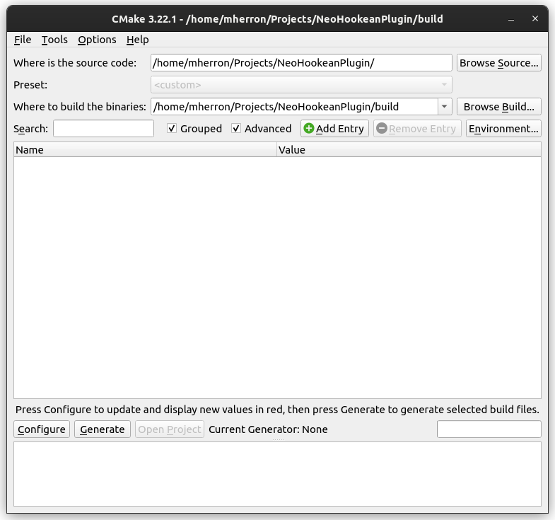
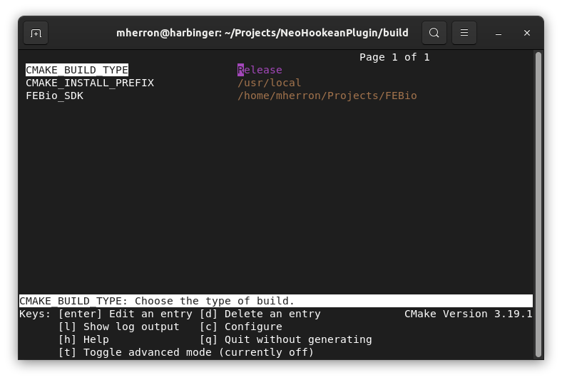
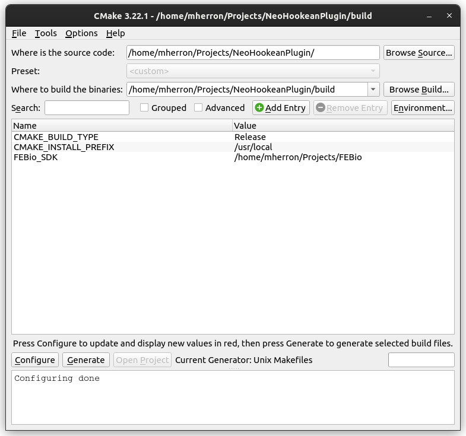

# FEBio Plugin Build Guide

### Table of contents
- [CMake](#cmake) 
- [Building the Plugin](#build)
- [Editing CMakeLists.txt for your own plugin](#edit)

## CMake <a name="cmake"></a>

We recommend using CMake when bulding plugins for FEBio. CMake is an open-source, cross-platform tool designed to streamline the configuration of the build environment. The CMake script in this repository will help you to locate necessary FEBio libraries on your machine, and set up include and library paths.

Please download the latest release of CMake from https://cmake.org/, and install it on your machine before proceeding. Many Linux distributions come with CMake pre-installed, or have CMake available through their package managers. 

### Running CMake

CMake is used to configure the build environment for FEBio plugins on your machine. It can be used to generate a Microsoft Visual Studio Solution on Windows, an XCode Project on macOS, and a set of makefiles to be used with the GNU Make tool on Linux. 

CMake generates a large number of configuration files that can cause the build directory to become cluttered. It is therefore strongly recommended that you do an [out-of-source build](https://gitlab.kitware.com/cmake/community/-/wikis/FAQ#what-is-an-out-of-source-build) by pointing CMake to an empty directory. If for some reason you find yourself needing to clear out your CMake configuration for your plugin and start this process from scratch, all you will need to do is delete everything in that build directory.

#### CMake GUI


<!--  -->

On Windows, and macOS CMake is run using the CMake graphical user interface (GUI). The CMake GUI is also available on Linux, but is generally installed separately, and so the command line interface (CLI) version, _ccmake_ is generally used (see below).

To start the configuration process, enter the path to the root directory of the plugin repository that you've downloaded onto your machine into the box labeled _Where is the source code:_. To insure that you are doing an out-of-source build, enter the path to the _build_ directory of your plugin repository in the box labeled _Where to build the binaries:_. You may also locate these directories using a file browser by clicking on the _Browse_ buttons to the right of these fields. 

#### ccmake


<!--  -->

If you are running Linux and have not installed the CMake GUI, there are two ways to run cmake. You can run the command `cmake` which will call CMake and run through the configuration and generation processes automatically. This method, however does not allow for interactivity, and so it is highly recommended that you instead run the command `ccmake`. This will run an interactive version of CMake with an in-terminal GUI as shown above. Using ccmake should allow you to follow along with the rest of this tutorial. To start an out-of-source build with ccmake, open a terminal in the _build_ directory of your local copy of the plugin repository and run the following command:

```
ccmake ..
```

#### First Configuration

The configuration step in the CMake build process runs the script defined in `CMakeLists.txt` located in the root directory of the plugin repository. The script will attempt to automatically locate FEBio on your machine.

To run the configuration process click the _Configure_ button in the lower left part of the GUI, or type `c` if you are using ccmake. If you are running the CMake GUI, you will be asked to choose a generator for the project. On Windows, choose the version of MSVC that you have installed and click _Finish_. On macOS, leave the default value and click _Finish_. CMake will now run the configuration process, the output of which can be seen in the text field at the bottom of the GUI. If all goes well, new fields will be added in red to the GUI, and it should look something like the image below:


<!--  -->

However, you may be greeted with a dialog saying that there was an error. If this is the case, you will find the error message in red text in the text field at the bottom of the GUI. The most common error you will encounter on the first run will say that CMake was unable to locate the FEBio SDK. If the script fails to locate the FEBio SDK or git repository automatically, then you will need to manually enter its location in the _FEBio_SDK_ variable in CMake.


#### Project Generation

Once configuration process completes without any errors, is time to generate the platform-specific build files. It's always a good idea to run Configure one more time before you generate the build files. Once you've run Configure again, click the _Generate_ button (or type `g` if you're using ccmake). On Windows this will generate a Visual Studio Project, on macOS this will generate an XCode Project, and on Linux this will generate a Makefile. If you're running Windows or macOS, you can click the _Open Project_ button and it will automatically open the created project. 

## Building the Plugin <a name="build"></a>

### Windows

Once you have the Visual Studio project open, you can choose whether you'd like to build a debug or a release version of the software, and then start the build process by either clicking on the Play button, or by pressing _F5_.

### macOS
Once you have the XCode project open, you can start the build by either click on the Play button, or by pressing ⌘R.

### Linux

Once the Makefiles have been generated, open a terminal in the _build_ directory, and run `make`. If your machine has multiple cores, you can increase the speed of the build by passing a `-j` flag to _make_, followed by the number of threads you want _make_ to use (e.g. `make -j4`). Please note that this will only decrease the speed of the build, and will in no way affect the final binary. After a successful build, the compiled binary can be found in the _bin_ subdirectory.

## Editing CMakeLists.txt for your own plugin <a name="edit"></a>

The included CMakeLists.txt file is meant to be easily editable for use in your own plugins. Near the top of the CMakeLists.txt file, there is a section with variables that you should edit in order to adapt this file for use in your plugin.

The value of the _PLUGIN_NAME_ variable should be edited to match the name of your plugin. (e.g. `set(PLUGIN_NAME MyPlugin)`)

The value of the _FEBio_LIB_NAMES_ variable should be edited to include all of the FEBio library names that your plugin needs to link to (e.g. `set(FEBio_LIB_NAMES fecore febiolib febiomech xml febioplot febiofluid febiomix)`). In general, if you include a file from a directory in FEBio's code, you need to link to the library that matches that directory's name. 

This CMakeLists.txt file should be placed in the same directory as your source and header files. It will automatically include all *.h files in its directoy, and compile  all *.cpp files in its directory.
